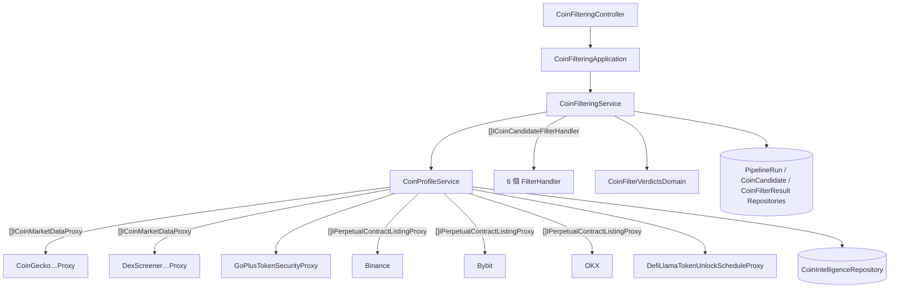

# 候選幣過濾 — Architecture Design

**Status:** Confirmed（使用者授權一律採 best practice）
**Source PRD:** `.sdd/2026-10-05-coin-candidate-filtering/PRD.md`
**Tech context:** Go · Gin · GORM + PostgreSQL · Clean / Onion Architecture（entity 乾淨、行為住 `domains/`、外部資源一律 `Proxy`）

---

## 1. Design Goal & Guiding Principle

- **In one sentence:** 對最新成功探索的候選幣先一次「取齊資料」成為每枚幣的**幣種檔案**，再交給一串彼此獨立的**過濾處理器**逐條判斷，保存每枚幣的規則結果與是否保留，整個過程落成一筆「過濾」管線輪次。
- **Guiding principle:** **取資料與判斷完全分開。**
  - 判斷：使用者要求的策略模式——每條規則一個 struct（`XxxFilterHandler`），共同實作 `ICoinCandidateFilterHandler`，組裝根注入 `[]ICoinCandidateFilterHandler`。處理器是**純函式式的判斷**：只讀幣種檔案、不碰 I/O，因此每條規則可單獨測、單獨增減。
  - 取資料：`CoinProfileService` 是唯一碰外部來源的地方，負責批次查詢、識別幣、合併來源，產出 `CoinProfileVo`。加一條需要新資料的規則 = 在檔案上加欄位 + 新增 proxy + 新增處理器；不需要新資料的規則只加一個處理器。

---

## 2. Change Scope

| Area | Action | What / Why |
| :--- | :--- | :--- |
| `domain/interface/i_coin_candidate_filter_handler.go` | **Add** | 過濾規則（策略）契約 |
| `domain/handler/*_filter_handler.go`（6 個） | **Add** | 六條規則各一個處理器 |
| `domain/interface/i_coin_market_data_proxy.go` · `i_token_security_proxy.go` · `i_perpetual_contract_listing_proxy.go` · `i_token_unlock_schedule_proxy.go` · `i_coin_filter_result_repository.go` | **Add** | 取資料與保存的契約 |
| `domain/models/vo/*` · `domains/*` · `dto/*` · `entities/coin_filter_result.go` | **Add** | 幣種檔案、規則結果、過濾規則門檻、金額描述、保留判定 |
| `domain/service/coin_profile_service.go` · `coin_filtering_service.go` | **Add** | 取齊資料；過濾編排 |
| `infrastructure/marketdata/*` | **Add** | CoinGecko、DEX Screener 市值資料；GoPlus 安全；幣安/Bybit/OKX 永續合約清單；DefiLlama 解鎖時程 |
| `application/coin_filtering_application.go` · `controller/coin_filtering_controller.go` | **Add** | 用例與 HTTP |
| `vo.InformationItemVo` · `entities.CoinIntelligence` · `DexScreenerTokenProfileInformationSourceProxy` · `InformationItemDomain` | **Modify** | 情報多帶 `ChainID`、`ContractAddress`（鏈上看板宣告）；DEX 位址**保留原大小寫**（Solana 位址區分大小寫），去重鍵不再小寫化 |
| `ICoinIntelligenceRepository` | **Modify** | 新增 `FindDeclaredContractAddresses(symbols)`：候選幣在探索時宣告的鏈與位址 |
| `PipelineRunStepVo` · `PipelineRunDomain` · `IPipelineRunRepository` | **Modify** | 新步驟 `filtering`；`ConcludeFiltering(keptCount)`；`FindLatestSucceeded` 已足夠 |
| `config` · `dependencies.go` · `SchemaMigrator` · README · Postman · `.claude/rules` | **Modify** | 門檻與來源網址設定、組裝、新表、文件；規則補上 `domain/handler/` 與 `Handler` 後綴 |
| 探索流程與其判斷規則 | **Not touched** | 只多記兩個欄位 |

---

## 3. New Classes / Modules

### 3.1 過濾策略

```go
// ICoinCandidateFilterHandler is one filtering rule; the composition root injects them as a list.
type ICoinCandidateFilterHandler interface {
    FilterName() string                                         // 如 "securityCheck"
    Evaluate(coinProfile vo.CoinProfileVo) vo.FilterVerdictVo   // 通過 / 淘汰 / 無資料 + 理由
}
```

| Handler（`domain/handler/`） | FilterName | 讀檔案的哪些欄位 | 門檻（`CoinFilterPolicyVo`） |
| :--- | :--- | :--- | :--- |
| `SecurityCheckFilterHandler` | `securityCheck` | `TokenSecurity` | `MaximumTaxRate`（10%） |
| `LiquidityThresholdFilterHandler` | `liquidityThreshold` | `MarketData.DailyVolumeUsd` | `MinimumDailyVolumeUsd`（100 萬） |
| `FullyDilutedValuationFilterHandler` | `fullyDilutedValuation` | `MarketData.FullyDilutedValuationUsd` | `Minimum/MaximumFullyDilutedValuationUsd`（1,000 萬 / 10 億） |
| `CirculatingRatioFilterHandler` | `circulatingRatio` | `MarketData` 三種供給量 | `MinimumCirculatingRatio`（20%） |
| `UnlockScheduleFilterHandler` | `unlockSchedule` | `UnlockEvents`、`MarketData.CirculatingSupply`、`EvaluatedAt` | `UnlockLookahead`（14 天）、`MaximumUnlockRatio`（5%） |
| `PerpetualContractListingFilterHandler` | `perpetualContractListing` | `PerpetualContractExchanges` | — |

所有金額、供給量、比率一律 `decimal.Decimal`（邊界用精確比較）。理由字串中的金額由 `UsdAmountDomain.Describe()`／`TokenQuantityDomain.Describe()` 轉成「52 億美元」「1,000 萬美元」「99 萬美元」「5,000 萬」這種中文寫法；比率以「19%」「10.5%」呈現。

### 3.2 Domain

| Name | Kind | Responsibility |
| :--- | :--- | :--- |
| `CoinProfileVo` | VO | 一枚候選幣的幣種檔案：`CoinSymbol`、`EvaluatedAt`、`MarketData *CoinMarketDataVo`、`ContractAddress *TokenAddressVo`、`TokenSecurity *TokenSecurityVo`、`PerpetualContractExchanges []string`、`UnlockEvents []TokenUnlockEventVo`、`UnlockScheduleKnown bool` |
| `CoinMarketDataVo` | VO | `CoinGeckoID`、`Name`、`FullyDilutedValuationUsd`、`DailyVolumeUsd`、`CirculatingSupply`、`TotalSupply`、`MaxSupply`（皆 `*decimal`，查不到為 nil）、`ContractAddresses []TokenAddressVo` |
| `TokenAddressVo` | VO | `ChainID`（正規化：`ethereum`/`bsc`/`base`/`arbitrum`/`polygon`/`solana`/其他原樣）、`Address` |
| `TokenSecurityVo` | VO | `IsHoneypot`、`CannotSell`、`BuyTaxRate`、`SellTaxRate`（`*decimal`）、`IsMintable`、`CanFreezeHolders` |
| `TokenUnlockEventVo` | VO | `UnlockAt`、`Amount` |
| `CoinIdentityVo` | VO | 查詢用身分：`CoinSymbol`、`DeclaredContractAddress *TokenAddressVo` |
| `FilterVerdictVo` / `FilterOutcomeVo` | VO | `FilterName`、`Outcome`（`passed`/`rejected`/`noData`）、`Reason` |
| `CoinFilterPolicyVo` | VO | 全部門檻 |
| `CoinFilterVerdictsDomain` | Domain Model | 一枚幣的全部規則結果：`IsKept()`（無任何淘汰）、`ToCoinFilterResult(pipelineRunID, symbol)` |
| `UsdAmountDomain` / `TokenQuantityDomain` / `PercentageDomain` | Domain Model | 金額、數量、比率的中文描述（理由用） |
| `CoinFilterResult` | Entity | `PipelineRunID`、`CoinSymbol`、`IsKept`、`Verdicts []CoinFilterVerdictRecord`（`serializer:json`，一個 entity 一個 repository）；(`PipelineRunID`,`CoinSymbol`) 唯一；`ToDto()` |
| `ErrNoSucceededDiscoveryRun` · `ErrCoinProfileSourceUnavailable` | 哨兵錯誤 | 「尚無成功的探索輪次」→ 409；來源整體故障（包住來源名稱與原因）→ 輪次失敗 |

### 3.3 外部來源（`infrastructure/marketdata/`）

| Interface | Implementation | 來源 | 重點 |
| :--- | :--- | :--- | :--- |
| `ICoinMarketDataProxy`（list，依優先序） | `CoinGeckoCoinMarketDataProxy` | `/api/v3/coins/list?include_platform=true` + `/api/v3/coins/markets?vs_currency=usd&ids=…`（每批 ≤ 250） | 有宣告位址者以平台位址對到幣；否則同代號取市值最大者；回傳含平台位址 |
| | `DexScreenerCoinMarketDataProxy` | `/tokens/v1/{chain}/{addresses}`（每批 ≤ 30） | 只處理有宣告位址者；取流動性最大的交易對之 `fdv`、`volume.h24`；無供給量 |
| `ITokenSecurityProxy` | `GoPlusTokenSecurityProxy` | `/api/v1/token_security/{chainId}?contract_addresses=…`、`/api/v1/solana/token_security?contract_addresses=…` | 只支援六條主流鏈；稅率字串 → 比率；Solana 的 mintable/freezable、EVM 的 is_mintable、transfer_pausable、is_blacklisted |
| `IPerpetualContractListingProxy`（list） | `BinancePerpetualContractListingProxy` · `BybitPerpetualContractListingProxy` · `OkxPerpetualContractListingProxy` | 幣安 `exchangeInfo`、Bybit `instruments-info?category=linear`、OKX `public/instruments?instType=SWAP` | 只取 USDT 計價、可交易、加密原生的永續合約之基礎幣代號 |
| `ITokenUnlockScheduleProxy` | `DefiLlamaTokenUnlockScheduleProxy` | `defillama-datasets.llama.fi/emissionsProtocolsList` + `/emissions/{protocol}` | 以 CoinGecko id 或正規化名稱對到 protocol，再以 `gecko_id`/名稱確認；`metadata.events` 的時間與數量 |

### 3.4 Service / Application / Controller

| Name | Responsibility |
| :--- | :--- |
| `CoinProfileService.AssembleCoinProfiles(ctx, candidates, evaluatedAt) ([]vo.CoinProfileVo, error)` | 讀宣告位址 → 依優先序查市值資料 → 決定安全檢查用位址 → 批次查安全資料 → 並行取三家永續合約清單 → 查解鎖時程 → 組出每枚幣的檔案。任何來源**整體**失敗 → `ErrCoinProfileSourceUnavailable`（寫明來源與原因） |
| `CoinFilteringService.FilterCoinCandidates(ctx, triggerSource) (dto.PipelineRunDto, error)` | 找最新成功探索（無 → `ErrNoSucceededDiscoveryRun`，不建輪次）→ 建過濾輪次（串上游）→ `CoinProfileService` 取檔案（失敗 → 輪次失敗、不存結果）→ 每枚幣跑全部處理器 → `CoinFilterVerdictsDomain` 判保留 → 存結果 → `ConcludeFiltering` |
| `CoinFilteringService.GetLatestKeptCoinCandidates(ctx)` | 最新成功過濾輪次中保留的結果 |
| `CoinFilteringService.GetCoinFilterResultsOfPipelineRun(ctx, runID)` | 某輪全部結果；查無輪次 → `ErrPipelineRunNotFound` |
| `CoinFilteringApplication` | 轉呼叫；手動觸發帶 `manual` |
| `CoinFilteringController` | `POST /coin-filterings`（409：尚無成功探索）、`GET /coin-filter-results/latest-kept`、`GET /pipeline-runs/:pipelineRunId/coin-filter-results`（400/404） |

`CoinFilteringService` 以具體型別持有 `*CoinProfileService`（Domain Service 不定介面），Application 只呼叫一個方法即完成一輪過濾。

---

## 4. Modified Components

| Component | Current role | Change needed |
| :--- | :--- | :--- |
| `InformationItemVo` / `CoinIntelligence` | 情報 | 加 `ChainID`、`ContractAddress`；`InformationItemDomain` 照抄 |
| `DexScreenerTokenProfileInformationSourceProxy` | 鏈上新幣看板 | 宣告鏈與位址；原文識別保留原大小寫；交易對以不分大小寫比對 |
| `ICoinIntelligenceRepository` | 情報存取 | `FindDeclaredContractAddresses(ctx, symbols) (map[string]vo.TokenAddressVo, error)`（同代號多筆取最新發布者） |
| `PipelineRunDomain` | 輪次轉換 | `ConcludeFiltering(keptCount, finishedAt)` |
| `config` | 設定 | `FilterConfig`：六項門檻（`FILTER_*`）、GoPlus / DefiLlama 網址、來源逾時 20 秒 |
| `.claude/rules/architecture.md` · `naming.md` | 規範 | 新增 `domain/handler/`（策略處理器，純判斷、不碰 I/O）與 `Handler` 後綴 |

---

## 5. Component Relationships



---

## 6. Extensibility & Handoff Notes

- **Most likely next requirement:** 新增或調整一條規則（如「持幣集中度」「上線天數」）；AI 洞察切片讀「最新成功過濾輪次的保留候選幣」及其檔案摘要。
- **Where it lands:** 新規則 = 新 `XxxFilterHandler` + 組裝根 list 一行；需要新資料時在 `CoinProfileVo` 加欄位並由 `CoinProfileService` 填入。
- **How to add it:** 不改任何既有處理器；門檻放 `CoinFilterPolicyVo`。
- **Patterns applied & why:** 策略模式（使用者指定，規則是最常變動的軸）；來源 list 注入（與探索一致）；取資料／判斷分離（判斷可純單元測試）。
- **Do not hardcode:** 門檻（設定）、支援的鏈清單（`TokenAddressVo` 正規化表）、來源網址。
- **Known debt / deferred:** 以代號對市值資料的誤認風險；解鎖資料集涵蓋率有限；不快取來源回應（每輪重抓）。`CoinProfileService.AssembleCoinProfiles` 內含「市值來源先到先得、安全檢查位址優先序、只為已上永續合約的幣查安全資料」三條取資料規則；刻意不拆成需依序呼叫的 Domain Model（會變成淺介面），等第二個需要同樣規則的呼叫者出現時再抽。
- **Shared technical piece:** 所有 proxy 共用 `internal/utilities/GetJson`（單一 GET、要求 200、大小上限 32 MiB、解碼）；改請求標頭或上限只改這一處。

---

## 7. Traceability

| PRD Scenario | Fulfilled by |
| :--- | :--- |
| 六條全部通過即保留 / 任一淘汰即淘汰 / 無資料不淘汰 | `CoinFilterVerdictsDomain.IsKept` + 各 Handler 理由 |
| 安全檢查五個情境 | `SecurityCheckFilterHandler` + `GoPlusTokenSecurityProxy` 正規化 |
| 成交額 / 估值 / 流通比八個情境 | `LiquidityThresholdFilterHandler`、`FullyDilutedValuationFilterHandler`、`CirculatingRatioFilterHandler` + `UsdAmountDomain` 等描述 |
| 解鎖三個情境 | `UnlockScheduleFilterHandler` |
| 永續合約兩個情境 | `PerpetualContractListingFilterHandler` + 三個 listing proxy |
| 成功並串上探索 / 全部淘汰為無資料 / 手動 | `CoinFilteringService` + `PipelineRunDomain.ConcludeFiltering` |
| 從未有成功的探索 | `CoinFilteringService` → `ErrNoSucceededDiscoveryRun` → 409 |
| 資料來源整體無法取得 | `CoinProfileService` → `ErrCoinProfileSourceUnavailable` → 輪次失敗 |
| 最新保留 / 從未成功為空 / 某輪全部結果 / 不存在輪次 | `CoinFilteringService` 查詢 + `CoinFilterResultRepository` |

---

## 8. Risks & Open Decisions

- **Risks / trade-offs:** `CoinProfileService.AssembleCoinProfiles` 是一個長方法（多來源依序合併），依規則不拆單一呼叫者的 private method；以段落註解分隔。CoinGecko 免費端點每輪約 2–3 次呼叫，GoPlus 每鏈一次，DefiLlama 只抓對到的 protocol。
- **Open decisions (for implementation):** 無。
