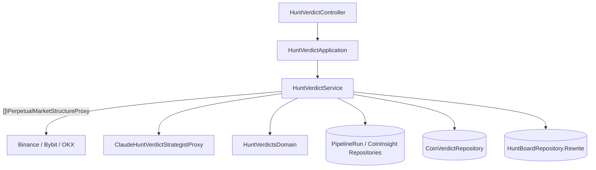

# 獵捕裁決與獵捕結果表 — Architecture Design

**Status:** Confirmed（使用者授權一律採 best practice）
**Source PRD:** `.sdd/2026-10-05-coin-hunt-verdict/PRD.md`
**Tech context:** Go · Gin · GORM + PostgreSQL · `anthropic-sdk-go` v1.78 · Clean / Onion Architecture

---

## 1. Design Goal & Guiding Principle

- **In one sentence:** 對最新成功洞察的成功洞察，補上裁決當下的市場結構，整輪問 CIO 一次，把回覆正規化成每枚幣的裁決，保存為輪次歷史，並以一筆交易改寫獵捕結果表。
- **Guiding principle:** **AI 只給判斷，數字由 domain 決定。** CIO 回覆的是「操作與百分比」，夾值、停損停利價換算、缺價改判、漏給 / 多給的對應全在 `HuntVerdictsDomain`；結果表的「覆蓋 + 移除」語意封裝在 `HuntBoardRepository.Rewrite` 一個方法、一筆交易內，呼叫端不需要知道 upsert 與 delete 的順序。

---

## 2. Change Scope

| Area | Action | What / Why |
| :--- | :--- | :--- |
| `domain/interface/i_hunt_verdict_strategist_proxy.go` · `i_coin_verdict_repository.go` · `i_hunt_board_repository.go` | **Add** | CIO、裁決歷史、結果表的契約 |
| `domain/models/vo/*` · `domains/hunt_verdicts_domain.go` · `dto/*` · `entities/coin_verdict.go` · `entities/hunt_board_entry.go` | **Add** | 素材、回覆、裁決正規化、結果表列 |
| `domain/service/hunt_verdict_service.go` | **Add** | 裁決編排 |
| `infrastructure/verdict/claude_hunt_verdict_strategist_proxy.go` | **Add** | Claude：固定 CIO 系統提示（可快取）、JSON schema、effort、伺服器端拒答備援、SDK 不自動重送 |
| `infrastructure/persistence/coin_verdict_repository.go` · `hunt_board_repository.go` | **Add** | 歷史；結果表改寫（交易內 upsert + 刪除缺席者） |
| `application` · `controller` | **Add** | `HuntVerdictApplication`、`HuntVerdictController` |
| `PipelineRunStepVo` · `PipelineRunDomain` | **Modify** | 步驟 `verdict`；成功 / 失敗沿用 `Fail` 與新的 `Succeed` |
| `config` · `dependencies.go` · `SchemaMigrator` · README · Postman | **Modify** | `VERDICT_MODEL`（`claude-opus-5-5`）、`VERDICT_EFFORT`（`high`）、180 秒；組裝；兩張新表 |
| 市場結構 proxy | **Reuse** | 沿用洞察切片的 `[]IPerpetualMarketStructureProxy`（幣安 → Bybit → OKX） |

---

## 3. New Classes / Modules

| Name | Kind | Responsibility |
| :--- | :--- | :--- |
| `HuntVerdictMaterialVo` | VO | 一枚幣交給 CIO 的素材：洞察（方向、強度、催化劑、風險、證據、缺口）＋ `MarketStructure *PerpetualMarketStructureVo` |
| `HuntVerdictAnswerVo` | VO | CIO 對一枚幣的原始回覆：`CoinSymbol`、`Action`、`Confidence`、`Leverage`、`PositionSizePercent`、`StopLossPercent`、`TakeProfitPercent`（`decimal`）、`Rationale`、`ConflictResolution` |
| `HuntActionVo` | VO | `long` / `short` / `watch` / `avoid` |
| `HuntVerdictPolicyVo` | VO | 範圍：槓桿 1–5、部位 0–10%、停損 1–50%、停利 1–200%、信心 0–100 |
| `HuntVerdictsDomain` | Domain Model | 以素材為準對應回覆（不分大小寫；漏 → 觀望「CIO 未給出裁決」、多 → 忽略）；正規化每枚：操作、夾值、無價改判觀望、依方向換算停損停利價；輸出 `[]entities.CoinVerdict` |
| `CoinVerdict` | Entity | 輪次歷史：`PipelineRunID`、`CoinSymbol`、`Action`、`Confidence`、`Leverage`、`PositionSizeRatio`、`ReferencePrice`、`StopLossRatio`、`StopLossPrice`、`TakeProfitRatio`、`TakeProfitPrice`（`decimal`，可空）、`Rationale`、`ConflictResolution`；(`PipelineRunID`,`CoinSymbol`) 唯一；`ToDto()`、`ToHuntBoardEntry(calculatedAt)` |
| `HuntBoardEntry` | Entity | 獵捕結果表一列：`ID`、`CoinSymbol`（唯一）、`CalculatedAt`、`PipelineRunID` ＋ 與 `CoinVerdict` 相同的裁決欄位；`ToDto()` |
| `ErrNoSucceededInsightRun` | 哨兵錯誤 | 「尚無成功的洞察輪次」→ 409 |
| `IHuntVerdictStrategistProxy.SynthesizeVerdicts(ctx, materials)` | 介面 | 回覆不可用 → `domains.ErrHuntVerdictAnswerUnusable`（訊息「AI 回覆格式不合格」） |
| `IHuntBoardRepository.Rewrite(ctx, entries)` / `FindAll(ctx)` | 介面 | 一筆交易：以 `CoinSymbol` upsert 每列、刪除不在本輪的列；`FindAll` 依信心由高到低、同信心依代號 |
| `ICoinVerdictRepository.CreateAll` / `FindByPipelineRunID` | 介面 | 歷史 |
| `HuntVerdictService` | Domain Service | `SynthesizeHuntVerdicts(ctx, trigger)`：找最新成功洞察 → 取成功洞察 → 建輪次 → 取市場結構（第一家有的；查不到即無價）→ 問 CIO（不可用重問一次）→ `HuntVerdictsDomain` → 存歷史 → `Rewrite` 結果表 → 輪次成功；AI 失敗回失敗輪次（不回錯）、儲存失敗回錯。`GetHuntBoard`、`GetCoinVerdictsOfPipelineRun` |
| `HuntVerdictController` | Controller | `POST /hunt-verdicts`（409）、`GET /hunt-board`、`GET /pipeline-runs/:pipelineRunId/coin-verdicts`（400/404） |

---

## 4. Component Relationships

---

## 5. Extensibility & Handoff Notes

- **Most likely next requirement:** 排程切片在洞察後自動觸發裁決；結果表變化時推播；回測裁決績效。
- **Where it lands:** 排程呼叫 `HuntVerdictApplication` 的 job 版本（觸發來源 `job`）；推播可在 `Rewrite` 之後比較新舊結果表；回測讀 `CoinVerdict` 歷史。
- **Do not hardcode:** 模型、effort、範圍上下限（`HuntVerdictPolicyVo`）。
- **Known debt:** 兩個 Claude proxy（洞察、裁決）各自建立 client（幾行重複），換供應商時一併處理。

---

## 6. Traceability

| PRD Scenario | Fulfilled by |
| :--- | :--- |
| 空表寫入 / 移除缺席者 / 失敗不改動 | `HuntBoardRepository.Rewrite` + `HuntVerdictService` |
| 槓桿部位夾值 / 不認得的操作 / 信心夾值 | `HuntVerdictsDomain` |
| 做多做空停損停利價 / 停損距離夾值 / 無價改判 | `HuntVerdictsDomain` |
| CIO 漏給 / 多給 / 從未有成功洞察 | `HuntVerdictsDomain` + `ErrNoSucceededInsightRun` |
| 串上洞察輪次 / 依信心排序 / 某輪裁決 / 不存在輪次 | `HuntVerdictService` + repositories |
