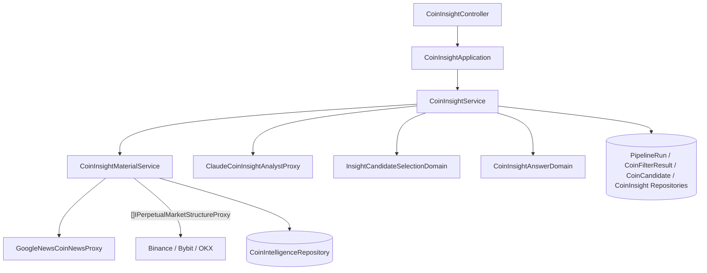

# 候選幣 AI 洞察 — Architecture Design

**Status:** Confirmed（使用者授權一律採 best practice）
**Source PRD:** `.sdd/2026-10-05-coin-insight-analysis/PRD.md`
**Tech context:** Go · Gin · GORM + PostgreSQL · `anthropic-sdk-go`（v1.78）· Clean / Onion Architecture

---

## 1. Design Goal & Guiding Principle

- **In one sentence:** 對最新成功過濾保留的候選幣，先收齊每枚幣的**洞察素材**（情報、新聞、市場結構、過濾結果），再以有限並行逐枚請 AI 回答一份固定格式的洞察，正規化後保存，落成一筆「洞察」管線輪次。
- **Guiding principle:** **AI 是一個可替換的 Proxy，業務規則全在 domain。** `ICoinInsightAnalystProxy` 只負責「把素材交給模型、把回覆解成 VO」；方向正規化、強度夾值、重問一次、失敗分類、輪次判定都在 domain，換模型或換供應商不動規則。素材收集沿用過濾切片的做法：一個 Domain Service 專責取資料（`CoinInsightMaterialService`），編排與判斷在另一個（`CoinInsightService`）。

---

## 2. Change Scope

| Area | Action | What / Why |
| :--- | :--- | :--- |
| `domain/interface/i_coin_insight_analyst_proxy.go` · `i_coin_news_proxy.go` · `i_perpetual_market_structure_proxy.go` · `i_coin_insight_repository.go` | **Add** | AI、新聞、市場結構、洞察存取的契約 |
| `domain/models/vo/*` · `domains/*` · `dto/*` · `entities/coin_insight.go` | **Add** | 素材、AI 回覆、洞察正規化、候選挑選、輪次結論 |
| `domain/service/coin_insight_material_service.go` · `coin_insight_service.go` | **Add** | 收素材；洞察編排（並行上限、重問一次） |
| `infrastructure/insight/claude_coin_insight_analyst_proxy.go` | **Add** | Claude Messages API：固定系統提示（可快取）、JSON schema 結構化輸出、effort、伺服器端備援模型 |
| `infrastructure/marketdata/*_perpetual_market_structure_proxy.go`（3 個）· `infrastructure/news/google_news_coin_news_proxy.go` | **Add** | 免費市場結構與新聞 |
| `application/coin_insight_application.go` · `controller/coin_insight_controller.go` | **Add** | 用例與 HTTP |
| `ICoinIntelligenceRepository` | **Modify** | `FindByCoinSymbolsSince(symbols, since)`：素材用的情報標題 |
| `PipelineRunStepVo` · `PipelineRunDomain` | **Modify** | 步驟 `insight`；`ConcludeInsight(succeededCount)` |
| `config` · `dependencies.go` · `SchemaMigrator` · README · Postman | **Modify** | AI 與素材設定、組裝、新表、文件 |
| 探索、過濾的規則 | **Not touched** | 只讀它們的結果 |

---

## 3. New Classes / Modules

### 3.1 Domain

| Name | Kind | Responsibility |
| :--- | :--- | :--- |
| `CoinInsightMaterialVo` | VO | 一枚幣交給 AI 的全部素材：代號、`IntelligenceHeadlines []IntelligenceHeadlineVo`、`NewsHeadlines []NewsHeadlineVo`、`MarketStructure *PerpetualMarketStructureVo`、`FilterVerdicts []FilterVerdictVo`、`DataGaps []string` |
| `PerpetualMarketStructureVo` | VO | `ExchangeName`、`LastPrice`、`PriceChangeRatio24h`、`QuoteVolumeUsd24h`、`FundingRate`、`OpenInterestUsd`、`OpenInterestChangeRatio24h`（皆 `*decimal`） |
| `NewsHeadlineVo` / `IntelligenceHeadlineVo` | VO | 標題、來源、時間 |
| `CoinInsightAnswerVo` | VO | AI 原始回覆：`Direction string`、`Strength int`、`Catalyst`、`Risks`、`Evidence`、`DataGaps` |
| `CoinInsightAnswerDomain` | Domain Model | 正規化：方向（`bullish`/`bearish`/`neutral`，認不得 → `neutral`）、強度夾到 1–10、合併素材缺口與 AI 缺口（去重保序）；`ToCoinInsight(runID, symbol)` |
| `InsightCandidateSelectionDomain` | Domain Model | 從保留結果中依「最早被提及」排序取前 N 枚（同時間依代號） |
| `CoinInsightDirectionVo` | VO | `bullish` / `bearish` / `neutral` |
| `CoinInsight` | Entity | `PipelineRunID`、`CoinSymbol`、`Succeeded`、`FailureReason`、`Direction`、`Strength`、`Catalyst`、`Risks`/`Evidence`/`DataGaps`（`serializer:json`）、`MarketStructureExchange`；(`PipelineRunID`,`CoinSymbol`) 唯一；`ToDto()` |
| `ErrNoSucceededFilteringRun` · `ErrCoinInsightAnswerUnusable` | 哨兵錯誤 | 「尚無成功的過濾輪次」→ 409；AI 回覆不可用（格式不合、拒答、截斷）→ 重問依據 |
| `PipelineRunDomain.ConcludeInsight(succeededCount, finishedAt)` | 行為 | ≥1 → 成功；0 → 失敗「所有候選幣分析失敗」 |

### 3.2 介面與實作

| Interface | Implementation | 重點 |
| :--- | :--- | :--- |
| `ICoinInsightAnalystProxy.AnalyzeCoin(ctx, material) (CoinInsightAnswerVo, error)` | `ClaudeCoinInsightAnalystProxy` | `client.Beta.Messages.New`：模型（預設 `claude-opus-5-5`）、`OutputConfig{Effort, Format: JSON schema}`、固定系統提示＋`CacheControl`、`Fallbacks: "default"`（beta `server-side-fallback-2026-07-01`，政策拒答時由伺服器改派備援模型）、每次 120 秒逾時。`stop_reason` 為 `refusal` / `max_tokens` 或 JSON 不合 schema → `ErrCoinInsightAnswerUnusable`；其他 API 錯誤原樣包裝 |
| `ICoinNewsProxy.FindRecentHeadlines(ctx, coinSymbol, since, limit)` | `GoogleNewsCoinNewsProxy` | `news.google.com/rss/search?q="SYMBOL" crypto when:3d`；RSS 解析、依時間新到舊 |
| `IPerpetualMarketStructureProxy`（list，優先序） | `Binance…`、`Bybit…`、`Okx…PerpetualMarketStructureProxy` | 幣安：`ticker/24hr` + `premiumIndex` + `openInterestHist?period=1h&limit=25`；Bybit：`market/tickers` + `market/open-interest?intervalTime=1h&limit=25`；OKX：`market/ticker` + `public/funding-rate` + `public/open-interest`（無歷史 → 變化留空）。查無合約 → found=false |
| `ICoinInsightRepository` | `CoinInsightRepository` | `CreateAll`、`FindByPipelineRunID` |

### 3.3 Service / Application / Controller

| Name | Responsibility |
| :--- | :--- |
| `CoinInsightMaterialService.GatherCoinInsightMaterials(ctx, coinFilterResults, gatheredAt)` | 讀情報標題（探索時間窗內、每枚最多 20）；每枚幣查新聞（最多 10、近 3 天）與市場結構（依交易所優先序，第一家有的）；來源出錯或查無 → 記缺口，**不回錯**（只有儲存錯誤回錯） |
| `CoinInsightService.AnalyzeCoinCandidates(ctx, triggerSource)` | 找最新成功過濾（無 → `ErrNoSucceededFilteringRun`、不建輪次）→ 讀保留結果與其探索候選（排序用）→ `InsightCandidateSelectionDomain` 取前 N → 建洞察輪次（串上游）→ 收素材 → 以 semaphore（上限 3）並行：每枚 `AnalyzeCoin`，遇 `ErrCoinInsightAnswerUnusable` 重問一次 → `CoinInsightAnswerDomain` 正規化 → 存全部結果 → `ConcludeInsight` |
| `CoinInsightService.GetLatestCoinInsights` / `GetCoinInsightsOfPipelineRun` | 最新成功洞察輪次的全部洞察；某輪全部結果（查無 → `ErrPipelineRunNotFound`） |
| `CoinInsightController` | `POST /coin-insights`（409）、`GET /coin-insights/latest`、`GET /pipeline-runs/:pipelineRunId/coin-insights`（400/404） |

---

## 4. Modified Components

| Component | Change |
| :--- | :--- |
| `ICoinIntelligenceRepository` | `FindByCoinSymbolsSince(ctx, symbols, since) ([]entities.CoinIntelligence, error)`，新到舊 |
| `config` | `InsightConfig`：`ANTHROPIC_API_KEY`、`ANTHROPIC_BASE_URL`（選填）、`INSIGHT_MODEL`（`claude-opus-5-5`）、`INSIGHT_EFFORT`（`low`）、`INSIGHT_MAX_CONCURRENT_ANALYSES`（3）、`INSIGHT_MAX_COINS_PER_ROUND`（20）、`GOOGLE_NEWS_BASE_URL` |

---

## 5. Component Relationships

---

## 6. Extensibility & Handoff Notes

- **Most likely next requirement:** 裁決切片讀「最新成功洞察輪次」的全部成功洞察；換模型或調思考深度；加一種素材（如社群熱度）。
- **Where it lands:** 換模型 = 設定；換 AI 供應商 = 另一個 `ICoinInsightAnalystProxy` 實作；新素材 = `CoinInsightMaterialVo` 加欄位 + 新 proxy + 系統提示說明該欄位。
- **Do not hardcode:** 模型、effort、並行與數量上限、來源網址；系統提示寫成常數以利快取（不得夾帶時間戳等變動內容）。
- **Known debt / deferred:** 新聞以代號搜尋可能混入同名雜訊，交由 AI 判讀；OKX 沒有持倉歷史，持倉變化留空。探索、過濾、洞察三個 service 各自寫一段「建輪次 → 工作 → 失敗或結論」：三者的失敗語意不同（洞察與探索回錯、過濾在來源故障時回失敗輪次），硬抽成共用模組需要旗標而變淺；裁決切片若出現第四份相同語意時再收攏。
- **Shared technical piece:** 所有輪次範圍路由的 `:pipelineRunId` 由 `utilities.PipelineRunIDFrom` 解讀，錯誤訊息為 `domains.ErrInvalidPipelineRunID`。

---

## 7. Traceability

| PRD Scenario | Fulfilled by |
| :--- | :--- |
| 每枚保留的幣產生洞察並串上過濾 / 手動 | `CoinInsightService` + `ConcludeInsight` |
| 從未有成功的過濾 | `ErrNoSucceededFilteringRun` → 409 |
| 合法值 / 強度夾值 / 不認得的方向 | `CoinInsightAnswerDomain` |
| 重問一次 / 兩次都不合格 / 全部失敗 | `CoinInsightService` 重問邏輯 + `ErrCoinInsightAnswerUnusable` + `ConcludeInsight` |
| 查不到新聞 / 查不到市場結構 | `CoinInsightMaterialService` 缺口 + `CoinInsightAnswerDomain` 合併缺口 |
| 超過上限只分析 20 枚 | `InsightCandidateSelectionDomain` |
| 最新洞察 / 空 / 某輪結果 / 不存在 | `CoinInsightService` 查詢 + `CoinInsightRepository` |

---

## 8. Risks & Open Decisions

- **Risks:** Claude API 費用由使用者金鑰支付（每輪 ≤ 20 次分析、各至多 2 次詢問）；結構化輸出保證 JSON 形狀，但值仍需 domain 正規化。
- **Open decisions:** 無。
