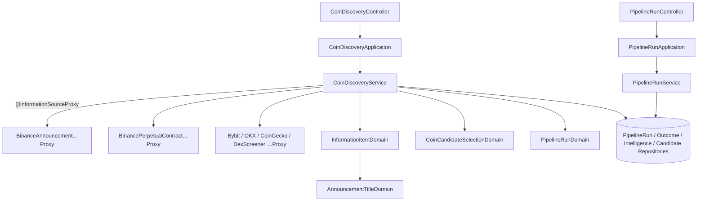

# 新幣情報探索 — Architecture Design

**Status:** Confirmed（使用者授權一律採 best practice）
**Source PRD:** `.sdd/2026-10-05-coin-intelligence-discovery/PRD.md`
**Tech context:** Go · Gin · GORM + PostgreSQL · Clean / Onion Architecture（依賴指向 domain；entity 乾淨、行為住 `domains/`；外部資源一律 `Proxy`）

---

## 1. Design Goal & Guiding Principle

- **In one sentence:** 一個 Domain Service 同時向「一串」資訊來源索取情報，各來源獨立成敗；把新情報去重保存，再從探索時間窗內的情報彙出本輪候選幣，整個過程落成一筆管線輪次。
- **Guiding principle:** **資訊來源是一個介面的 list，service 只認得介面。**
  使用者要求的「IInformationProvider」在本專案規則下命名為 **`IInformationSourceProxy`**（外部資源一律 `Proxy`、介面以能力命名、不綁供應商）。每個來源一個實作 struct，組裝根把 `[]IInformationSourceProxy` 注入 `CoinDiscoveryService`。**加一個來源 = 新增一個 Proxy 檔 + 在組裝根的 list 多一行**，其餘零修改。
  來源只負責「把外部格式正規化成 `InformationItemVo`」，**幣種代號辨識、非新幣排除、時間窗、輪次狀態判定等業務規則全部留在 domain**，不散進各 Proxy。

---

## 2. Change Scope

| Area | Action | What / Why |
| :--- | :--- | :--- |
| `domain/interface/i_information_source_proxy.go` | **Add** | 資訊來源的唯一契約 |
| `domain/interface/i_clock_proxy.go` + `infrastructure/clock/system_clock_proxy.go` | **Add** | 「本輪開始時間」可測 |
| `domain/interface/i_pipeline_run_repository.go` · `i_information_source_outcome_repository.go` · `i_coin_intelligence_repository.go` · `i_coin_candidate_repository.go` | **Add** | 一 entity 一 repository |
| `domain/models/entities/*`（4 個） | **Add** | `PipelineRun`、`InformationSourceOutcome`、`CoinIntelligence`、`CoinCandidate` |
| `domain/models/domains/*` | **Add** | 代號辨識、候選幣彙整、輪次狀態判定（見 §3） |
| `domain/models/vo/*` · `dto/*` | **Add** | 來源情報、探索規則、輪次步驟 / 狀態 / 觸發來源、回傳 DTO |
| `domain/service/coin_discovery_service.go` · `pipeline_run_service.go` | **Add** | 探索編排；輪次歷史與中斷收尾 |
| `infrastructure/informationsource/*` | **Add** | 6 個來源 Proxy + 各自 wire 型別 |
| `infrastructure/persistence/*_repository.go` | **Add** | GORM 實作 |
| `application/coin_discovery_application.go` · `pipeline_run_application.go` | **Add** | 用例 |
| `controller/coin_discovery_controller.go` · `pipeline_run_controller.go` | **Add** | HTTP |
| `infrastructure/persistence/schema_migrator.go` | **Modify** | AutoMigrate 4 個 entity |
| `config/application_config.go` | **Modify** | `DiscoveryConfig`（時間窗、排除名單、每來源上限、逾時、各來源網址） |
| `cmd/server/dependencies.go` · `main.go` | **Modify** | 組裝 Proxy list、路由；啟動時中斷收尾 |
| `README.md` · `postman/` | **Modify / Add** | 環境變數、路由、Postman 集合 |
| 背景 job | **Not touched** | 排程管線切片才接；`TriggerSource` 已預留 `job` |
| 過濾 / AI / 裁決 | **Not touched** | 後續切片 |

---

## 3. New Classes / Modules

### 3.1 介面

```go
// IInformationSourceProxy 是一個免費資訊來源；一個來源一個實作。
type IInformationSourceProxy interface {
    SourceName() string                                                   // 如 "binanceAnnouncement"
    FetchInformationItems(executionContext context.Context, itemLimit int) ([]vo.InformationItemVo, error)
}
```

### 3.2 資訊來源實作（`infrastructure/informationsource/`）

| Name | SourceName | 來源 | 正規化重點 |
| :--- | :--- | :--- | :--- |
| `BinanceAnnouncementInformationSourceProxy` | `binanceAnnouncement` | `www.binance.com/bapi/composite/v1/public/cms/article/list/query?type=1&catalogId=48` | 標題、`code` 當原文識別、`releaseDate` |
| `BinancePerpetualContractInformationSourceProxy` | `binancePerpetualContract` | `fapi.binance.com/fapi/v1/exchangeInfo` | 取 `onboardDate` 最新的 N 個；`baseAsset` 為宣告代號；`contractType` 非 `PERPETUAL`（如 `TRADIFI_PERPETUAL`）標為傳統金融商品 |
| `BybitAnnouncementInformationSourceProxy` | `bybitAnnouncement` | `api.bybit.com/v5/announcements/index?locale=en-US&type=new_crypto` | 標題、連結、`dateTimestamp` |
| `OkxAnnouncementInformationSourceProxy` | `okxAnnouncement` | `www.okx.com/api/v5/support/announcements?annType=announcements-new-listings` | 標題、連結、`pTime` |
| `CoinGeckoTrendingInformationSourceProxy` | `coinGeckoTrending` | `api.coingecko.com/api/v3/search/trending` | `symbol` 為宣告代號；**無發布時間** |
| `DexScreenerTokenProfileInformationSourceProxy` | `dexScreenerTokenProfile` | `api.dexscreener.com/token-profiles/latest/v1` → 再以 `/tokens/v1/{chainId}/{addresses}` 批次補代號 | 宣告代號取 `baseToken.symbol`；原文識別 = `chainId:tokenAddress`；發布時間 = 最早交易對的 `pairCreatedAt`（PRD §4：新幣看重開始交易的時間），查無交易對則留空 |

全部共用一個 `*http.Client`（不設 client 逾時，逾時一律由 service 的每來源 context deadline 控制，逾時錯誤因此可辨識為「連線逾時」），基礎網址由設定注入（測試以 `httptest` 換掉）。回應缺少應有欄位（Bybit `retCode`、幣安 `symbols`、CoinGecko `coins`）視為該來源失敗。

### 3.3 Domain

| Name | Kind | Responsibility | Satisfies |
| :--- | :--- | :--- | :--- |
| `InformationItemVo` | VO | 來源回傳的一則訊息：`SourceName`、`ExternalIdentifier`、`Title`、`Link`、`PublishedAt *time.Time`、`DeclaredCoinSymbols []string`、`IsTraditionalAsset bool`；`ToDomain()` | US-01、US-03 |
| `InformationItemDomain` | Domain Model | `CoinIntelligences(pipelineRunID, receivedAt) []entities.CoinIntelligence`：宣告代號優先，否則交給 `AnnouncementTitleDomain`；一枚幣一則情報、辨識不出則一則無代號情報；無發布時間以 `receivedAt` 代替；代號一律大寫 | US-01、US-03 |
| `AnnouncementTitleDomain` | Domain Model | 從公告標題辨識代號：括號代號 `(XXX)`、合約名 `XXXUSDT`（1–15 個大寫英數字）；排除純數字與非代號字（UTC 等）；去重保序 | US-01、US-03 |
| `InformationSourceResultsDomain` | Domain Model | 一輪所有來源的回應：是否有任一來源成功、轉成來源結果、轉成情報（重構時自 service 收攏） | US-04 |
| `DiscoveryPolicyVo` | VO | 探索規則：`Window`、`ExcludedCoinSymbols`、`ItemLimitPerSource`、`SourceRequestTimeout` | US-02、US-03 |
| `CoinCandidateSelectionDomain` | Domain Model | 以 `DiscoveryPolicyVo` + 本輪開始時間，從情報中挑出：有代號、非排除、非傳統金融商品、`PublishedAt >= startedAt - Window`（含邊界）；依代號彙整成 `[]entities.CoinCandidate`（來源數、情報數、最早提及時間），依代號排序 | US-01、US-02、US-03 |
| `PipelineRunStepVo` / `PipelineRunStatusVo` / `PipelineRunTriggerSourceVo` | VO | `discovery`；`running/succeeded/failed/noData`；`job/manual` | US-04 |
| `PipelineRunDomain` | Domain Model | 輪次狀態轉換：`ConcludeDiscovery(sourceOutcomes, candidateCount, finishedAt) entities.PipelineRun`（任一來源成功＋候選 ≥1 → 成功；任一成功＋0 → 無資料；全敗 → 失敗「所有資訊來源皆失敗」）、`Fail(reason, finishedAt)` | US-04 |
| `PipelineRun` · `InformationSourceOutcome` · `CoinIntelligence` · `CoinCandidate` | Entity | 乾淨資料；`CoinIntelligence` 以 (`SourceName`,`ExternalIdentifier`,`CoinSymbol`) 唯一；`CoinCandidate` 以 (`PipelineRunID`,`CoinSymbol`) 唯一；各帶 `ToDto()` | 全部 |
| `ErrPipelineRunNotFound` | 哨兵錯誤 | 查無輪次 → 404 | US-05 |

### 3.4 Service / Application / Controller

| Name | Responsibility |
| :--- | :--- |
| `CoinDiscoveryService.DiscoverCoins(ctx, triggerSource) (dto.PipelineRunDto, error)` | 建輪次（寫入失敗即回錯）→ **並行**呼叫每個來源（各自 `context.WithTimeout`，`sync.WaitGroup`，一個失敗不取消其他）→ 存來源結果 → 情報 `SaveNew`（衝突略過）→ 讀時間窗內情報 → `CoinCandidateSelectionDomain` → 存候選幣 → `PipelineRunDomain.ConcludeDiscovery` → 更新輪次。中途任何儲存失敗 → 輪次標失敗並回錯 |
| `CoinDiscoveryService.GetLatestCoinCandidates(ctx)` | 最新一輪**成功**的探索輪次之候選幣；無則空 |
| `CoinDiscoveryService.GetCoinIntelligencesOfPipelineRun(ctx, runID)` | 查無輪次 → `ErrPipelineRunNotFound` |
| `PipelineRunService.GetPipelineRuns(ctx)` | 依開始時間新到舊，附來源結果 |
| `PipelineRunService.FailInterruptedPipelineRuns(ctx)` | 殘留 `running` → `failed`（「被重啟中斷」） |
| `CoinDiscoveryApplication` / `PipelineRunApplication` | 轉呼叫 service、回 DTO |
| `CoinDiscoveryController` | `POST /coin-discoveries`（手動觸發，回輪次）、`GET /coin-candidates/latest`、`GET /pipeline-runs/:pipelineRunId/coin-intelligences` |
| `PipelineRunController` | `GET /pipeline-runs` |

---

## 4. Modified Components

| Component | Current role | Change needed |
| :--- | :--- | :--- |
| `SchemaMigrator.Migrate` | 空的 AutoMigrate | 加入 4 個 entity |
| `config.ApplicationConfig` | server / database / job 開關 | 加 `Discovery DiscoveryConfig` |
| `registerRoutes` | 只有 `/health` | 組裝 `[]IInformationSourceProxy`、repositories、services、controllers |
| `main` | 開 DB、起 server | migrate 後呼叫 `FailInterruptedPipelineRuns`（失敗只記 log） |

---

## 5. Component Relationships



---

## 6. Extensibility & Handoff Notes

- **Most likely next requirement:** 加一個資訊來源（Upbit 公告、GeckoTerminal 新池、CryptoPanic）；以及下一個管線步驟（過濾）讀「最新成功探索輪次的候選幣」。
- **Where it lands:** `IInformationSourceProxy` 的 list；`PipelineRunStepVo` 新增步驟值、`PipelineRun.TriggeredByPipelineRunID` 串上游。
- **How to add it:** 實作 `IInformationSourceProxy`（只做正規化）→ 在 `registerRoutes` 的 list 加一行。代號辨識不夠用時擴充 `AnnouncementTitleDomain`，不要在 Proxy 內自己猜。
- **Patterns applied & why:** 介面 list 注入（Composite-ish fan-out）— 來源是最常變動的軸；Domain Model 收攏規則 — 規則與來源正交。
- **Do not hardcode:** 時間窗、排除名單、各來源網址（進 `DiscoveryConfig`，可由環境變數覆寫）；每來源上限與逾時是 PRD 固定規則，寫成 config 常數、不開放覆寫。
- **Known debt / deferred:** 情報不清除（量小，PostgreSQL 足夠）；來源不重試（下一輪自然再試）。

---

## 7. Traceability

| PRD Scenario | Fulfilled by |
| :--- | :--- |
| 不同來源提到同一枚幣只成為一個候選幣 | `CoinCandidateSelectionDomain` |
| 不同幣各自成為候選幣 | `CoinCandidateSelectionDomain` |
| 已收過的情報不重複保存 | `CoinIntelligenceRepository.SaveNew`（唯一鍵衝突略過）+ 時間窗讀取 |
| 時間窗內 / 邊界 / 超出 | `CoinCandidateSelectionDomain`（`>= startedAt - Window`） |
| 排除幣種不成為候選幣 | `CoinCandidateSelectionDomain` + `DiscoveryPolicyVo.ExcludedCoinSymbols` |
| 傳統金融商品不成為候選幣 | `BinancePerpetualContractInformationSourceProxy`（標記）+ `CoinCandidateSelectionDomain` |
| 看不出幣種的情報被保存但不產生候選幣 | `InformationItemDomain` + `AnnouncementTitleDomain` |
| 全部成功 / 部分失敗 / 無資料 / 全部失敗 | `CoinDiscoveryService`（隔離並行）+ `PipelineRunDomain.ConcludeDiscovery` |
| 服務重啟中斷執行中的輪次 | `PipelineRunService.FailInterruptedPipelineRuns` + `main` |
| 手動觸發的輪次記為手動 | `CoinDiscoveryApplication` 傳 `manual` |
| 最新候選幣 / 失敗不取代 / 從未成功 | `CoinDiscoveryService.GetLatestCoinCandidates` + `PipelineRunRepository.FindLatestSucceeded` |
| 輪次歷史由新到舊 | `PipelineRunService.GetPipelineRuns` |
| 查看某一輪的情報 / 不存在的輪次 | `CoinDiscoveryService.GetCoinIntelligencesOfPipelineRun` + `ErrPipelineRunNotFound` |

---

## 8. Risks & Open Decisions

- **Risks / trade-offs:** 幣安公告是非正式端點，格式變動時只該來源失敗；DEX Screener 需兩段呼叫（第二段失敗則整個來源失敗）。
- **Open decisions (for implementation):** 無。
