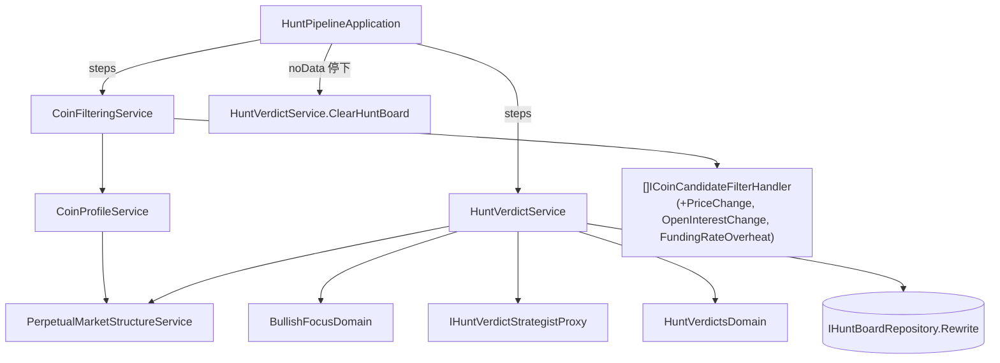

# 只獵看好的幣 — Architecture Design

**Status:** Confirmed
**Source PRD:** `.sdd/2026-10-06-bullish-coin-hunt/PRD.md`
**Tech context:** Go · Gin · GORM（Postgres）· Clean / Onion（`domain/models/{entities,domains,dto,vo}`、`domain/handler`、`domain/service`、`domain/interface`）

---

## 1. Design Goal & Guiding Principle

- **In one sentence:** 在過濾階段加三條讀永續合約市場結構的動能規則；裁決只吃看多且夠強的洞察、CIO 不再能做空；獵捕結果表只寫做多且信心達標的裁決；回合在「無資料」停下時清空結果表。
- **Guiding principle:** 「多看好才算看好」集中在**一個** Domain Model（`BullishFocusDomain`），兩個門檻都由 `HuntVerdictPolicyVo` 注入；動能規則沿用既有 `ICoinCandidateFilterHandler` 策略清單，新增 = 新 handler + 清單多一行。服務的流程骨架不分岔：沒有看多洞察時走同一條「零素材 → 零裁決 → 以空集合改寫結果表」路徑，只是不問 CIO。

---

## 2. Change Scope

| Area | Action | What / Why |
| :--- | :--- | :--- |
| `domain/models/vo/CoinProfileVo` | **Modify** | 多一個 `MarketStructure *PerpetualMarketStructureVo`，動能規則只讀幣種檔案（handler 不得自行對外取資料） |
| `domain/service/CoinProfileService` | **Modify** | 注入 `*PerpetualMarketStructureService`；對「有上永續合約」的候選幣**同時**取市場結構；查不到留 nil，不讓整輪失敗 |
| `domain/handler/` | **Add** | `PriceChangeFilterHandler`、`OpenInterestChangeFilterHandler`、`FundingRateOverheatFilterHandler` |
| `domain/models/domains/BullishFocusDomain` | **Add** | 挑看多洞察、挑上表裁決（含轉成結果表列） |
| `domain/models/vo/HuntVerdictPolicyVo` | **Modify** | 加 `MinimumBullishInsightStrength`、`MinimumHuntBoardConfidence`；移除 `MaximumShortTakeProfitPercent` |
| `domain/models/vo/HuntActionVo` | **Modify** | 移除 `HuntActionShort` |
| `domain/models/domains/HuntVerdictsDomain` | **Modify** | 刪除做空分支；做空落入「非法值 → 觀望」 |
| `domain/models/domains/PipelineRunDomain` | **Modify** | 加 `ConcludeVerdict(bullishCoinCount, finishedAt)`：0 → 無資料，否則成功 |
| `domain/service/HuntVerdictService` | **Modify** | 只對看多洞察取市場結構並詢問 CIO；零看多不問 CIO；以 `BullishFocusDomain` 選出的列改寫結果表；新增 `ClearHuntBoard` |
| `application/HuntPipelineApplication` | **Modify** | 回合停在「無資料」的步驟時呼叫 `HuntVerdictService.ClearHuntBoard`；清空失敗附註到停止原因 |
| `infrastructure/analysis/claude_prompts.go` | **Modify** | 裁決提示與 JSON schema 只允許 long / watch / avoid，說明本系統只找做多機會 |
| `internal/config` + `cmd/server/dependencies.go` | **Modify** | 新門檻的環境變數與注入；`huntVerdictPolicyFor` 改吃設定；`coinProfileServiceFor` 注入市場結構服務；`filterHandlersFor` 多三行 |
| README / Postman | **Modify** | 環境變數、規則與結果表語意說明 |
| 探索、洞察服務與分析師提示 | **Not touched** | PRD 明訂來源與分析師判斷方式不變 |
| 實體 `CoinVerdict` / `HuntBoardEntry` 與 schema | **Not touched** | 欄位不變，只是寫入的內容變了；不需 migration |
| 查詢 API 形狀 | **Not touched** | 結果表、輪次、歷史的回傳形狀不變 |

---

## 3. New Classes / Modules

| Name | Kind | Responsibility (purpose) | Collaborators | Satisfies (PRD scenario) |
| :--- | :--- | :--- | :--- | :--- |
| `PriceChangeFilterHandler` | Handler（策略） | 24 小時漲跌幅須在 [下限, 上限] 內（含） | `CoinProfileVo.MarketStructure` | US-01 漲跌幅五個情境、查不到市場結構 |
| `OpenInterestChangeFilterHandler` | Handler（策略） | 持倉量 24 小時變化須 ≥ 下限 | 同上 | US-01 持倉量四個情境 |
| `FundingRateOverheatFilterHandler` | Handler（策略） | 每期資金費率須 ≤ 上限；負費率自然通過 | 同上 | US-01 資金費率五個情境 |
| `BullishFocusDomain` | Domain Model | `SelectBullishInsights(coinInsights)`：分析成功、看多、強度 ≥ 門檻；`ToHuntBoardEntries(coinVerdicts, calculatedAt)`：做多且信心 ≥ 門檻的裁決轉成結果表列 | `HuntVerdictPolicyVo`、`CoinVerdict.ToHuntBoardEntry` | US-02 全部、US-04 全部 |

> 三條動能規則共享「查不到市場結構」的理由文字，但各自是獨立規則（可單獨移除），不另抽基底型別。

---

## 4. Modified Components

| Component | Current role | Change needed |
| :--- | :--- | :--- |
| `CoinProfileService.AssembleCoinProfiles` | 彙整市值、合約、安全、合約上架、解鎖 | 組完永續合約上架後，對有上架的幣以 `sync.WaitGroup.Go` 同時呼叫 `PerpetualMarketStructureService.FindMarketStructure`（在 base budget context 下）；結果寫入 `CoinProfileVo.MarketStructure` |
| `HuntVerdictService.SynthesizeHuntVerdicts` | 全部成功洞察都交給 CIO；全部裁決改寫結果表 | `BullishFocusDomain.SelectBullishInsights` → 只為這些幣取市場結構組素材 → 素材為空則不問 CIO、裁決為空 → 有裁決才 `CreateAll` → `Rewrite(BullishFocusDomain.ToHuntBoardEntries(...))` → `ConcludeVerdict(len(materials))` |
| `HuntVerdictService.ClearHuntBoard`（新方法） | — | `huntBoardRepository.Rewrite(ctx, [])`；供 application 在回合無資料停下時呼叫 |
| `HuntPipelineApplication.runSteps` | 第一個未成功的步驟即停 | 停在 `noData` 時呼叫 `ClearHuntBoard`；失敗則把「；清空獵捕結果表失敗：…」接在停止原因後；`failed` 不清空 |
| `HuntVerdictsDomain.ToCoinVerdicts` | 支援做多 / 做空換算 | 只換算做多（停損在下、停利在上）；做空走非法值 → 觀望 |
| `PipelineRunDomain` | 各步驟 Conclude 方法 | 加 `ConcludeVerdict` |
| `huntVerdictSystemPrompt` / `huntVerdictAnswerSchema` | 四種操作 | 三種操作；說明「只找做多機會，不做空」 |

---

## 5. Component Relationships

---

## 6. Extensibility & Handoff Notes

- **Most likely next requirement:** 調整「看好」的門檻或加新的動能訊號（例如成交量放大、價格突破），以及日後真的要「不看好」那一側。
- **Where it lands:**
  - 新訊號 → 新的 `ICoinCandidateFilterHandler`，在 `filterHandlersFor` 多一行；若需要新數據，加在 `CoinProfileVo` 與 `CoinProfileService`。
  - 門檻 → 環境變數（`internal/config`），不改程式。
  - 「多看好才算看好」的規則改變（例如上表要再看部位大小）→ 只改 `BullishFocusDomain`。
  - 不看好那一側 → 另一個 focus domain 與另一張結果表；`HuntVerdictsDomain` 只需重新接受做空（換算邏輯可從 git 歷史找回）。
- **Patterns applied & why:** Strategy（過濾規則清單，沿用既有 seam）；Domain Model 收斂門檻判斷，避免散在 service 裡的 `if`。
- **Do not hardcode:** 五個門檻全部走設定；資金費率、漲跌幅、持倉量一律以比例（0.1 = 10%）表示，與市場結構 VO 單位一致。
- **Known debt / deferred:** 手動單獨觸發探索 / 過濾得到無資料不清空結果表（只有回合會清）；若日後手動步驟常用，再把清空搬進各步驟服務。

---

## 7. Traceability

| PRD Scenario | Fulfilled by |
| :--- | :--- |
| US-01 漲跌幅：+12% / −10% / −10.5% / +60% / +61% | `PriceChangeFilterHandler` |
| US-01 查不到市場結構，三條皆無資料 | 三個動能 handler（`MarketStructure == nil`）+ `CoinProfileService`（查不到留 nil） |
| US-01 持倉量：+25% / −10% / −11% / 無資料 | `OpenInterestChangeFilterHandler` |
| US-01 資金費率：0.01% / 0.1% / 0.11% / −0.3% / 無資料 | `FundingRateOverheatFilterHandler` |
| US-01 淘汰即不保留 | 既有 `CoinFilterVerdictsDomain`（任一淘汰即淘汰） |
| US-02 只有看多交給 CIO、強度 6 / 5 | `BullishFocusDomain.SelectBullishInsights` + `HuntVerdictService` |
| US-02 沒有看多洞察不問 CIO、無資料、清空 | `HuntVerdictService` + `PipelineRunDomain.ConcludeVerdict` + `HuntBoardRepository.Rewrite([])` |
| US-03 做多停損停利價 | `HuntVerdictsDomain` |
| US-03 做空視為觀望 | `HuntVerdictsDomain`（非法值 → 觀望）+ 提示 / schema |
| US-03 避開保存歷史不上表 | `HuntVerdictService`（`CreateAll` 全部）+ `BullishFocusDomain.ToHuntBoardEntries` |
| US-04 只有做多上表、信心 50 / 49、全部不做多清空、取代舊表 | `BullishFocusDomain.ToHuntBoardEntries` + `HuntBoardRepository.Rewrite` |
| US-05 過濾 / 探索無資料清空 | `HuntPipelineApplication` + `HuntVerdictService.ClearHuntBoard` |
| US-05 洞察 / 裁決失敗保留 | `HuntPipelineApplication`（failed 不清空）+ 既有裁決失敗不改寫 |

---

## 8. Risks & Open Decisions

- **Risks / trade-offs:**
  - 過濾多了逐幣市場結構查詢；同時進行並受 base budget 約束，最壞情況被截斷的幣記無資料、不淘汰——寧可少擋也不錯殺。
  - 回合清空結果表與裁決步驟在不同交易中；清空失敗時結果表保留舊值並在回合原因標示，下一輪會再改寫。
- **Open decisions (for implementation):**
  - 新環境變數：`FILTER_MINIMUM_PRICE_CHANGE_RATIO`（-0.1）、`FILTER_MAXIMUM_PRICE_CHANGE_RATIO`（0.6）、`FILTER_MINIMUM_OPEN_INTEREST_CHANGE_RATIO`（-0.1）、`FILTER_MAXIMUM_FUNDING_RATE`（0.001）、`VERDICT_MINIMUM_BULLISH_INSIGHT_STRENGTH`（6）、`HUNT_BOARD_MINIMUM_CONFIDENCE`（50）。可為負的門檻需要一個允許負值的十進位解析函式。
  - 規則名稱（過濾結果中的 `filterName`）：`priceChange`、`openInterestChange`、`fundingRateOverheat`。

---

## 9. Improve-codebase Review

Reviewed the branch diff for scattered logic and shallow boundaries; each candidate was judged against `.claude/rules/`:

| Candidate | Decision | Why |
| :--- | :--- | :--- |
| The three momentum handlers each repeat "no market structure → no data" | **Rejected** | A shared base type or helper function would couple independent rules (rules say one rule, one handler, add/remove without touching others) and a package-level helper is a static utility the rules forbid. Three lines of guard per handler is the cheaper cost. |
| The hunt round clears the board again after a verdict step that already emptied it on no data | **Rejected** | One uniform rule ("a round stopped on no data empties the board") is easier to reason about than a step-specific exception; the rewrite is idempotent and cheap. |
| Pull "how bullish is bullish enough" out of the verdict service | **Already done** | `BullishFocusDomain` holds both thresholds; the service only calls it. |
| Leftover short-selling code paths, constants and prompt text | **Verified gone** | No short branch, constant or schema value remains; only historical verdicts in storage may still read "short". |

No refactor was necessary beyond what the implementation already landed.
